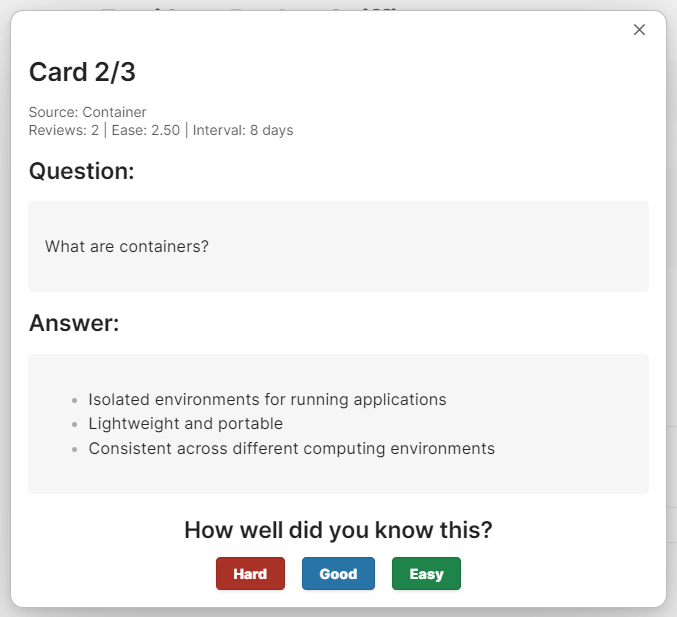
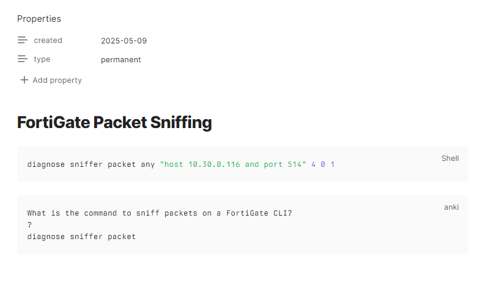
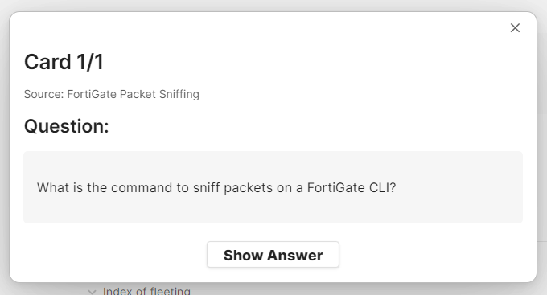
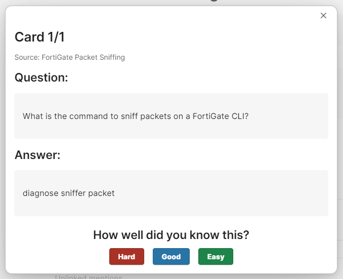
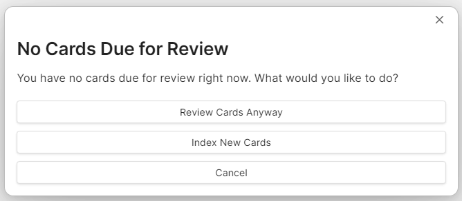
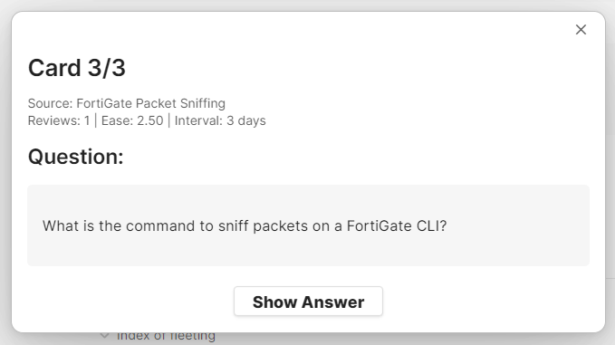
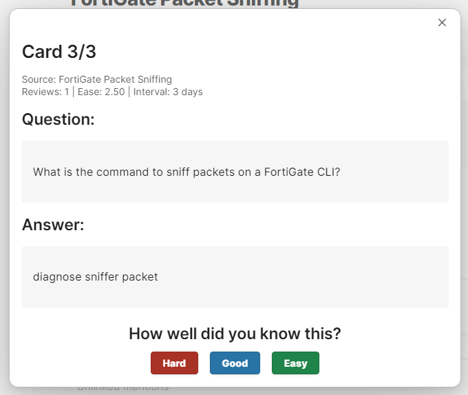

# Obsidian Anki

An Anki-like spaced repetition system integrated directly into Obsidian.



## Overview

Obsidian Anki brings the power of spaced repetition learning directly into your Obsidian vault. Create flashcards within your notes and review them using a SRS algorithm without ever leaving Obsidian.

## Features

- **Native Obsidian Integration**: Create and review cards directly in your Obsidian vault
- **Spaced Repetition Algorithm**: Uses a SRS algorithm similar to Anki
- **Markdown Support**: Cards support full Markdown formatting, including code blocks, lists, images, etc.
- **Automatic Indexing**: Automatically finds and indexes flashcards throughout your vault
- **Customizable Settings**: Adjust review sessions, card display, and SRS parameters

## Installation

1. Open Obsidian
2. Go to Settings > Community plugins
3. Turn off Safe mode
4. Click "Browse" and search for "Anki"
5. Find "Obsidian Anki" and click "Install"
6. Once installed, activate the plugin

## How to Use

### Creating Cards

Create flashcards in your notes using code blocks with the `anki` language identifier:

```anki
What is the capital of France?
?
Paris
```

You can add multiple cards in a single block by separating them with blank lines:

```anki
What is the capital of France?
?
Paris

What is the largest planet in our solar system?
?
Jupiter
```



### Indexing Cards

Cards are automatically indexed when Obsidian starts. You can also manually index:

1. Open the command palette (Ctrl/Cmd + P)
2. Search for "Index all Anki cards in vault"
3. Select the command to run it

### Reviewing Cards

There are multiple ways to start a review session:

- Click the Anki icon in the ribbon
- Use the command palette and search for "Review indexed Anki cards"
- Use the hotkey (if configured)

During review, you'll see:

1. The question
2. A button to show the answer
3. After showing the answer, rate your response as "Hard," "Good," or "Easy"





If you are out of review cards, you'll be given the option to review cards anyway.






### Viewing All Cards

To see all your indexed cards:

1. Open the command palette (Ctrl/Cmd + P)
2. Search for "View all indexed Anki cards"
3. This displays a list of all cards with their due dates and review statistics

## Customizing Settings

Settings can be accessed via Settings > Plugins > Obsidian Anki > Settings. Options include:

### Review Session

- Cards per session: Number of cards to review at once
- New cards per day: Maximum new cards to introduce daily
- Reviews per day: Maximum review cards to show daily

### Card Display

- Show source file: Display the file where the card originated
- Enable markdown rendering: Render markdown in cards (recommended)

### Spaced Repetition (Advanced)

- Easy bonus: Multiplier for "Easy" responses
- Interval modifier: Global multiplier for all intervals
- Maximum interval: Longest possible interval between reviews

### Interface

- Dark mode buttons: Use darker colors for rating buttons

### Automatic Indexing

- Enable automatic indexing: Automatically find cards when Obsidian opens

## Tips and Best Practices

- **Organize Related Cards**: Keep related flashcards in the same note for better context
- **Use Markdown Formatting**: Take advantage of formatting to make your cards more effective
- **Regular Reviews**: Make reviewing cards part of your daily Obsidian workflow
- **Adjust Settings**: Fine-tune the SRS algorithm based on your learning style

## FAQ

**Q: How does the SRS algorithm work?**  
A: The algorithm adjusts the interval between reviews based on how difficult you find each card, similar to Anki. Cards you find easy will appear less frequently than difficult ones.

**Q: Will this replace Anki?**  
A: For many Obsidian users, this plugin offers the key benefits of Anki without leaving Obsidian. For advanced Anki users, this might complement rather than replace Anki.

**Q: Can I sync these cards with the actual Anki app?**  
A: Currently, there's no direct synchronization with the Anki app. This plugin works entirely within Obsidian.

**Q: Where is the card data stored?**  
A: Card data is stored in the plugin's data folder within your Obsidian vault.

## Support and Contribution

If you encounter issues or have suggestions:

- Open an issue on the [GitHub repository](https://github.com/name/obsidian-anki)
- Contribute via pull requests

## License

[GNU General Public License](LICENSE)
